# Agent-Builder Architecture (Enhanced)

Comprehensive technical architecture with sequence diagrams and component interactions.

## Table of Contents
- [System Overview](#system-overview)
- [Architecture Layers](#architecture-layers)
- [Component Diagrams](#component-diagrams)
- [Sequence Diagrams](#sequence-diagrams)
- [Database Schema](#database-schema)
- [Security Architecture](#security-architecture)
- [Performance Considerations](#performance-considerations)

---

## System Overview

Agent-Builder is a full-stack application for creating LLM-based agents through a five-phase workflow leveraging Claude's extended thinking capabilities.

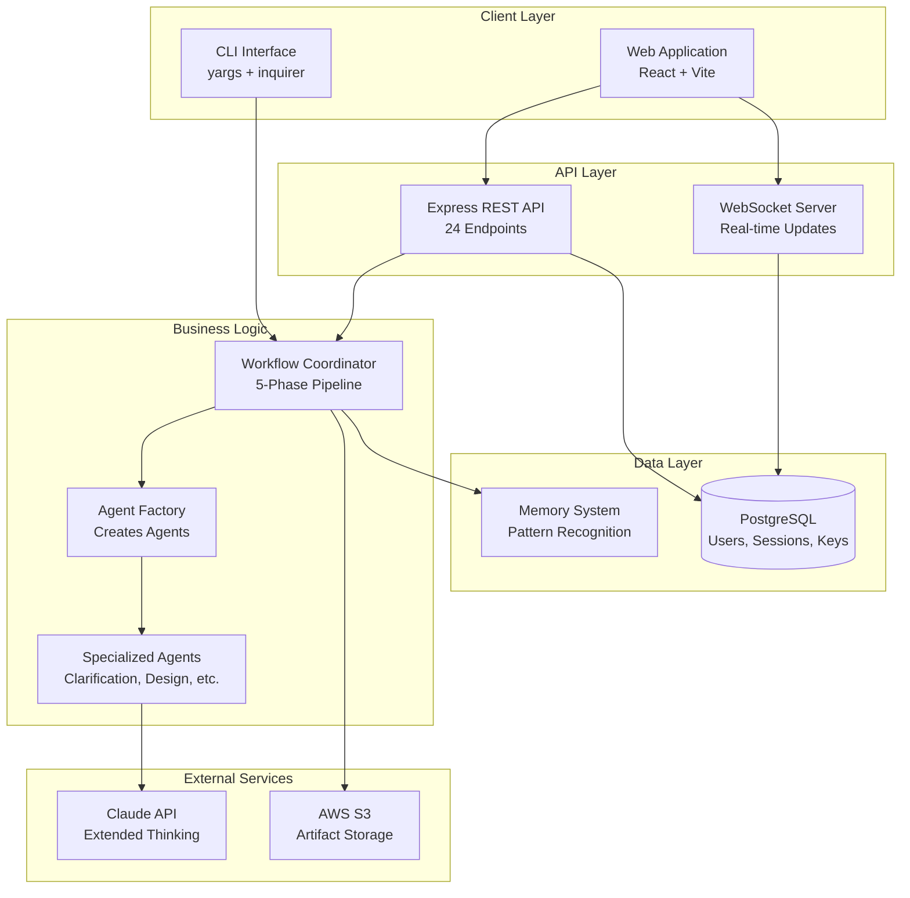

---

## Architecture Layers

### 1. Presentation Layer

**CLI Interface** (`src/cli/`):
- Command-line interface using yargs
- Interactive mode with inquirer
- Configuration management
- Output formatting with chalk

**Web Application** (planned - `web/`):
- React with TypeScript
- Tailwind CSS for styling
- React Query for API state management
- WebSocket client for real-time updates

### 2. API Layer

**REST API** (`src/server/`):
- Express.js with TypeScript
- 24 REST endpoints across 5 route groups
- JWT-based authentication
- Rate limiting and security middleware
- Prometheus metrics endpoint

**WebSocket Server** (`src/server/websocket.ts`):
- Real-time session progress updates
- JWT authentication via query params
- Heartbeat for connection health
- Session-based connection management

### 3. Business Logic Layer

**Workflow Coordinator** (`src/orchestration/`):
- Orchestrates 5-phase agent creation pipeline
- Manages context and state transitions
- Coordinates parallel agent execution
- Integrates with memory system

**Agent System** (`src/agents/`):
- BaseAgent abstract class with lifecycle management
- Specialized agents for each phase
- Retry logic and timeout handling
- Claude API integration

**Template System** (`src/templates/`):
- Handlebars-based code generation
- Multi-format support (Skills, MCP, CLI, Library)
- Multi-language support (TypeScript, Python)
- Inline fallback templates

### 4. Integration Layer

**Claude Integration** (`src/claude/`):
- Anthropic SDK wrapper
- Extended thinking support (up to 10K tokens)
- Retry logic with exponential backoff
- Response parsing with Zod validation

**AWS S3 Integration** (`src/server/storage/s3-store.ts`):
- Artifact upload/download
- Presigned URL generation
- Metadata management
- Multipart upload for large files

### 5. Data Layer

**PostgreSQL Database** (`src/server/storage/`):
- User management and SSO authentication
- Session tracking with progress
- Encrypted API key storage (AES-256-GCM)
- Audit logging
- Connection pooling (max 20 connections)

**Memory System** (`src/memory/`):
- JSONL-based session storage
- Pattern matching with cosine similarity
- Metrics tracking and aggregation
- Learning from successful sessions

---

## Component Diagrams

### High-Level Component Interaction

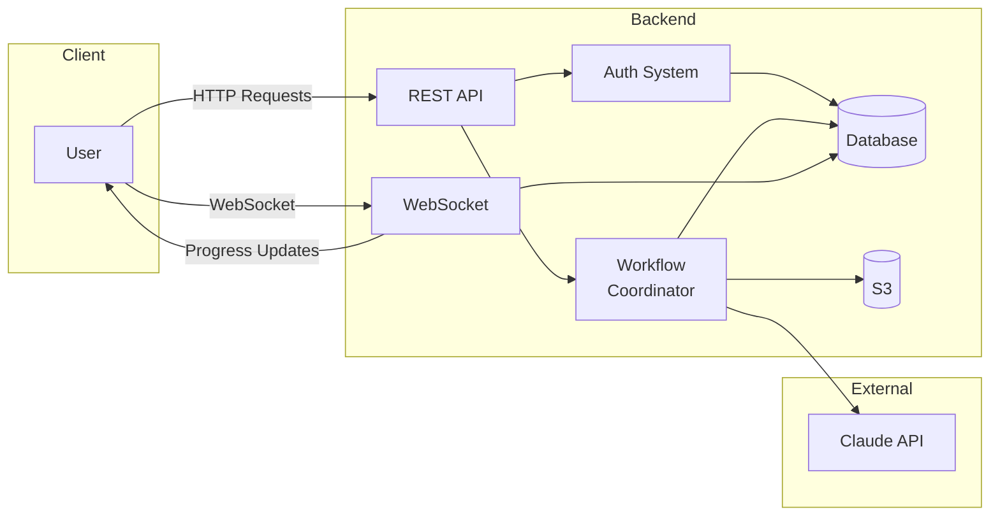

### Workflow Coordinator Internal Structure

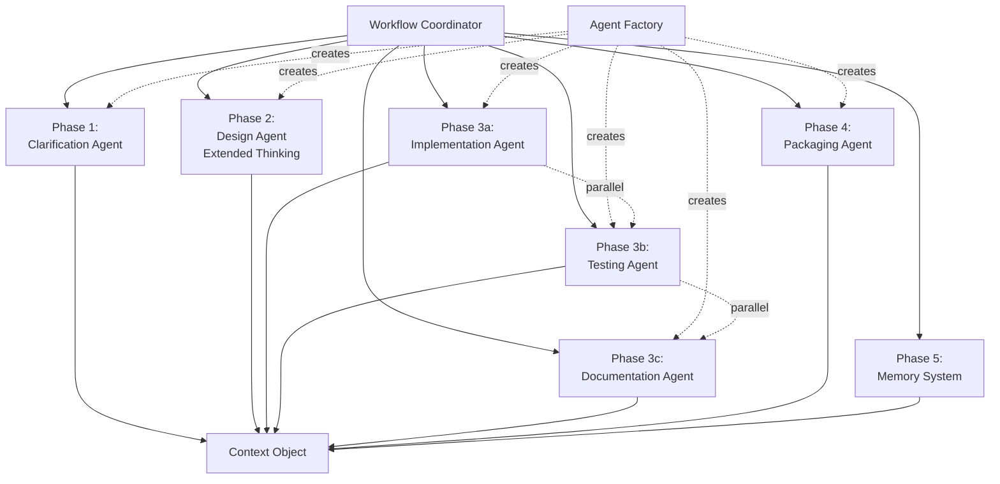

### Authentication Flow Components

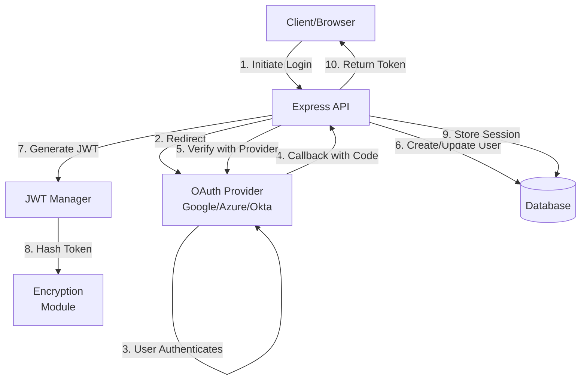

---

## Sequence Diagrams

### Complete Agent Creation Flow

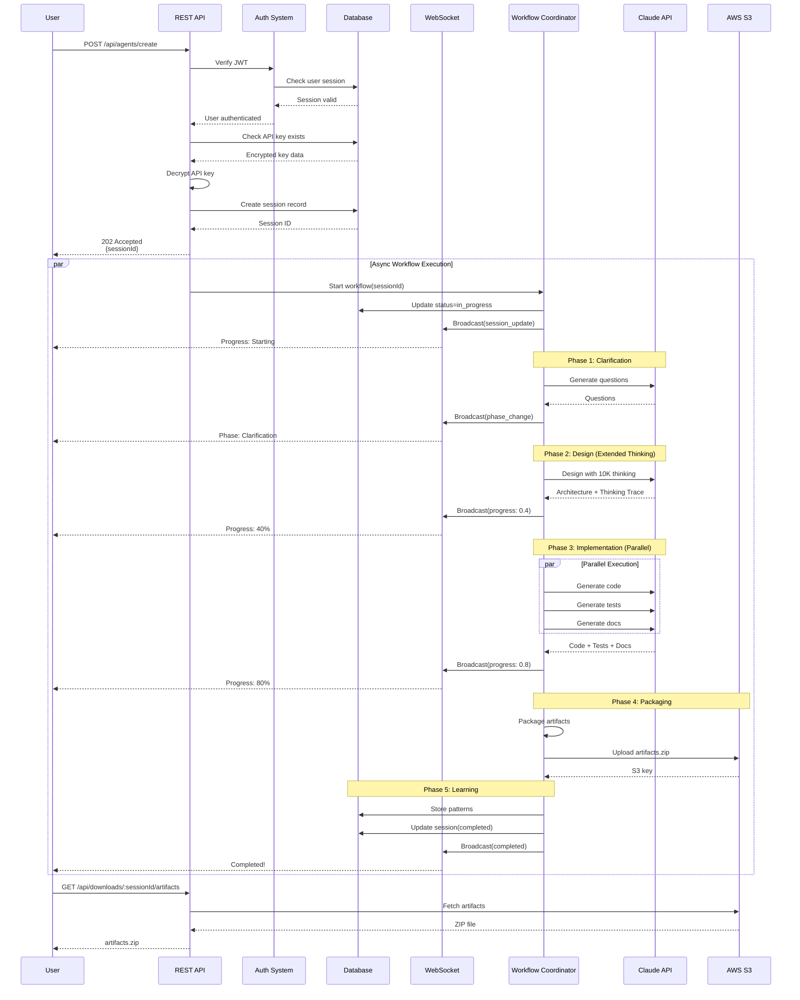

### Authentication Flow (SSO)

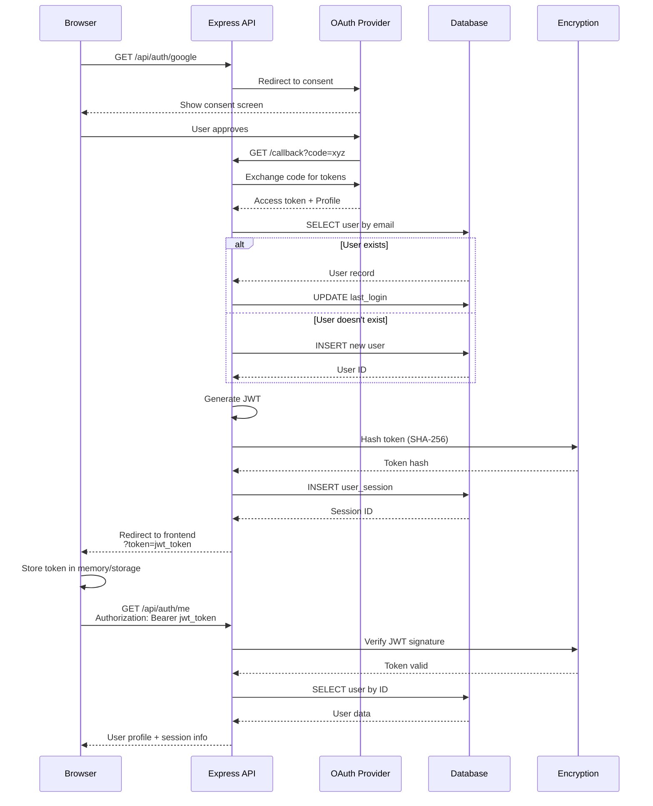

### WebSocket Connection and Updates

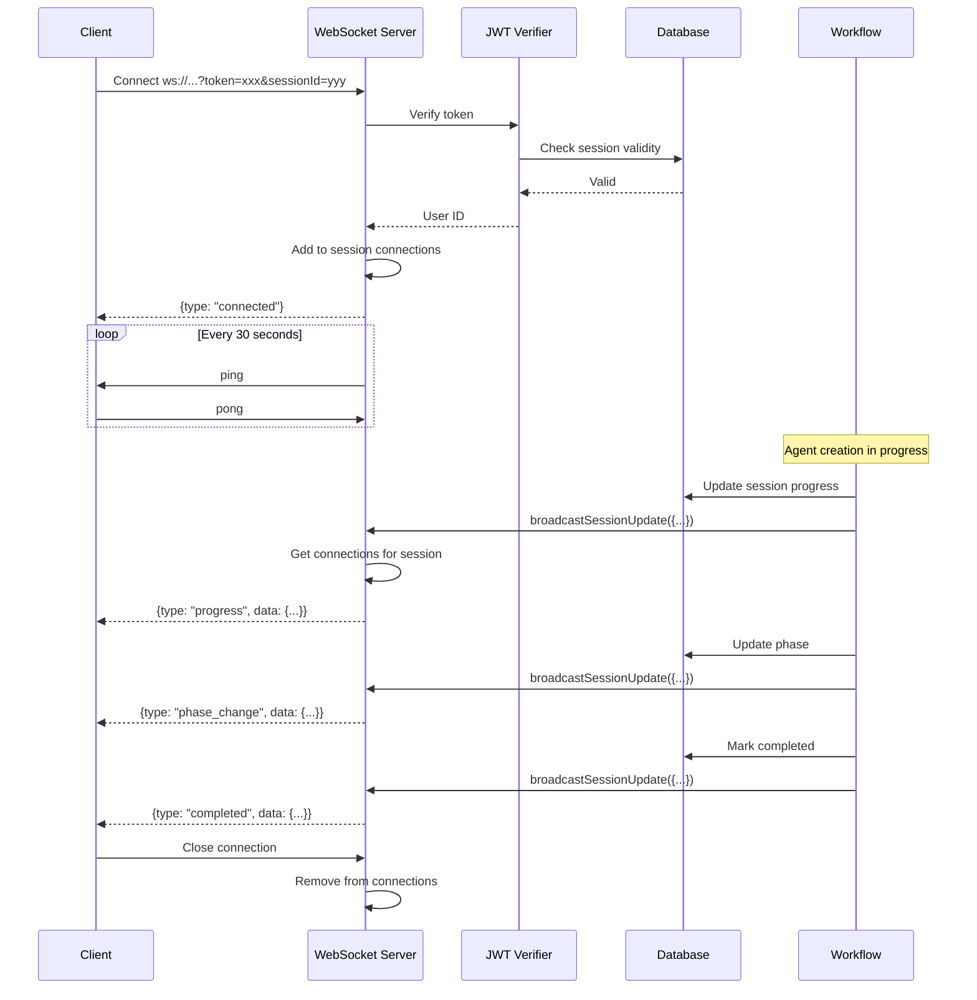

### API Key Storage and Encryption

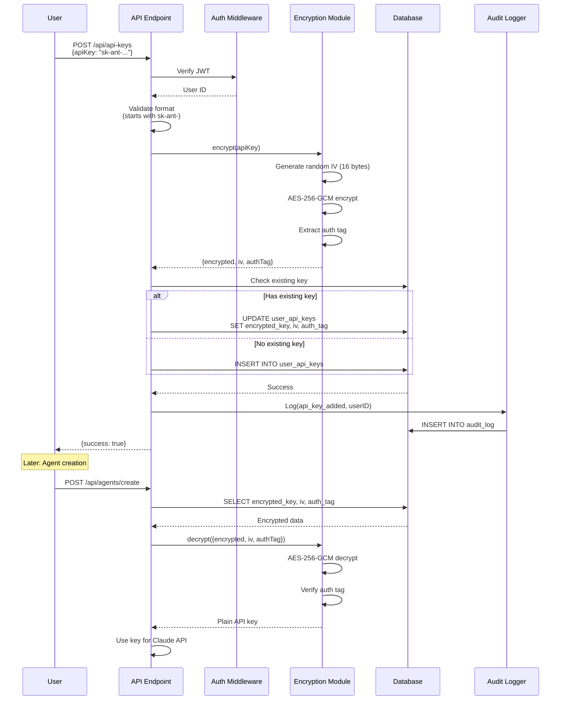

### Five-Phase Workflow Execution

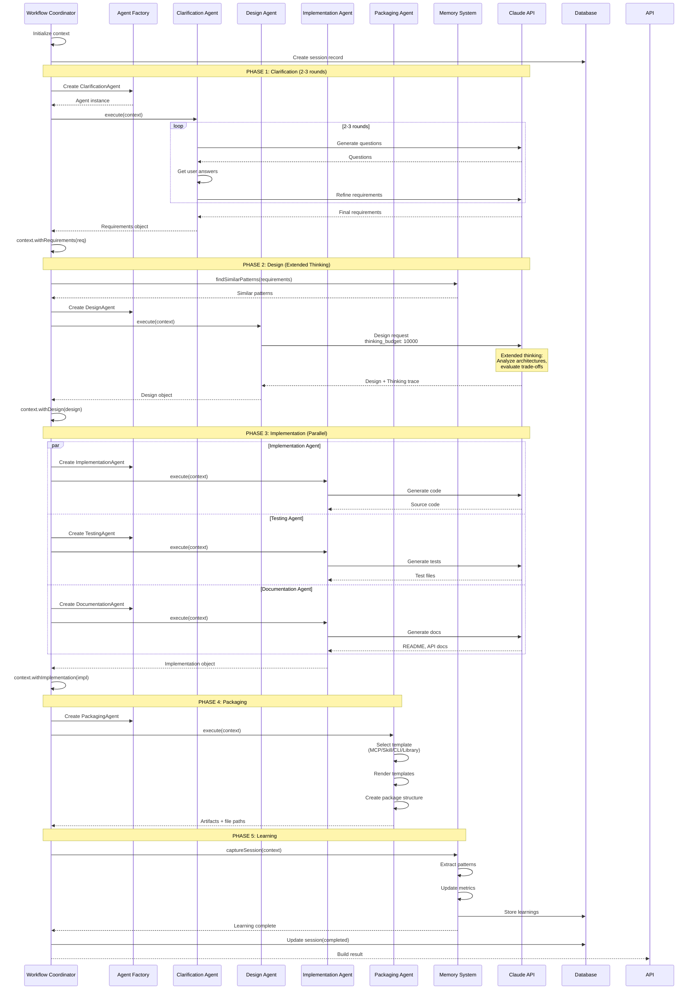

---

## Database Schema

### Entity-Relationship Diagram

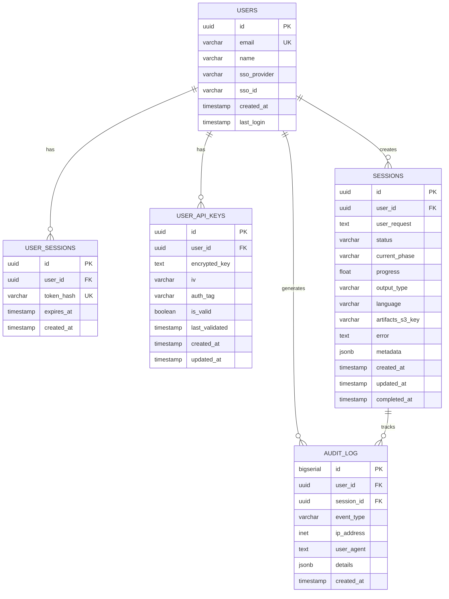

### Key Database Features

**Indexes**:
- B-tree indexes on all foreign keys
- Composite index on `(user_id, status)` for session queries
- Partial index on `expires_at` for active sessions only

**Triggers**:
- Auto-update `updated_at` timestamp on row modification
- Cleanup expired sessions (can be called via cron)

**Views**:
- `active_sessions_view`: Join sessions with user info
- `user_session_stats`: Aggregate statistics per user

**Functions**:
- `cleanup_expired_sessions()`: Remove expired JWT sessions
- `cleanup_old_sessions()`: Remove sessions older than 7 days
- `update_updated_at_column()`: Trigger function for timestamps

---

## Security Architecture

### Multi-Layer Security Model

```mermaid
graph TB
    subgraph "Request Flow"
        Client[Client Request]
        Helmet[Helmet.js<br/>Security Headers]
        CORS[CORS<br/>Origin Check]
        RateLimit[Rate Limiting]
        Auth[JWT Auth]
        Handler[Route Handler]
        Response[Response]
    end

    Client --> Helmet
    Helmet --> CORS
    CORS --> RateLimit
    RateLimit --> Auth
    Auth --> Handler
    Handler --> Response

    subgraph "Data Security"
        APIKey[API Keys]
        Encrypt[AES-256-GCM]
        DB[(Encrypted Storage)]

        APIKey --> Encrypt
        Encrypt --> DB
    end

    subgraph "Authentication"
        OAuth[OAuth Provider]
        JWT[JWT Token]
        Session[Session Store]

        OAuth --> JWT
        JWT --> Session
    end
```

### Encryption Details

**API Key Encryption** (AES-256-GCM):
```
Key: 32 bytes (from ENCRYPTION_KEY env var)
IV: 16 bytes random per encryption
Algorithm: AES-256-GCM
Auth Tag: 16 bytes for integrity verification

Storage Format:
{
  encrypted: base64(ciphertext),
  iv: hex(initialization_vector),
  authTag: hex(authentication_tag)
}
```

**JWT Token Format**:
```
Header:
{
  "alg": "HS256",
  "typ": "JWT"
}

Payload:
{
  "userId": "uuid",
  "email": "user@example.com",
  "name": "User Name",
  "iat": 1707217200,
  "exp": 1707822000,
  "iss": "agent-builder"
}

Signature: HMACSHA256(
  base64UrlEncode(header) + "." + base64UrlEncode(payload),
  JWT_SECRET
)
```

**Token Storage**:
- Token never stored in plain text
- SHA-256 hash stored in database
- Constant-time comparison for lookup

### Rate Limiting Strategy

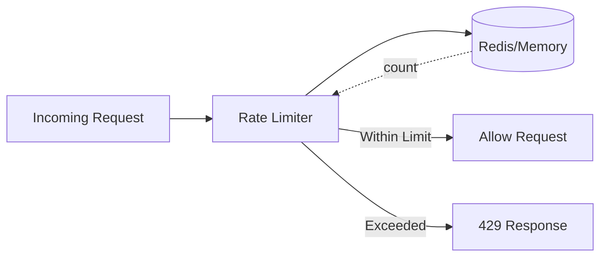

**Configuration**:
- Standard endpoints: 100 req/15min per IP
- Auth endpoints: 10 req/15min per IP
- Agent creation: 10 req/hour per user
- Downloads: 50 req/15min per user

---

## Performance Considerations

### Caching Strategy

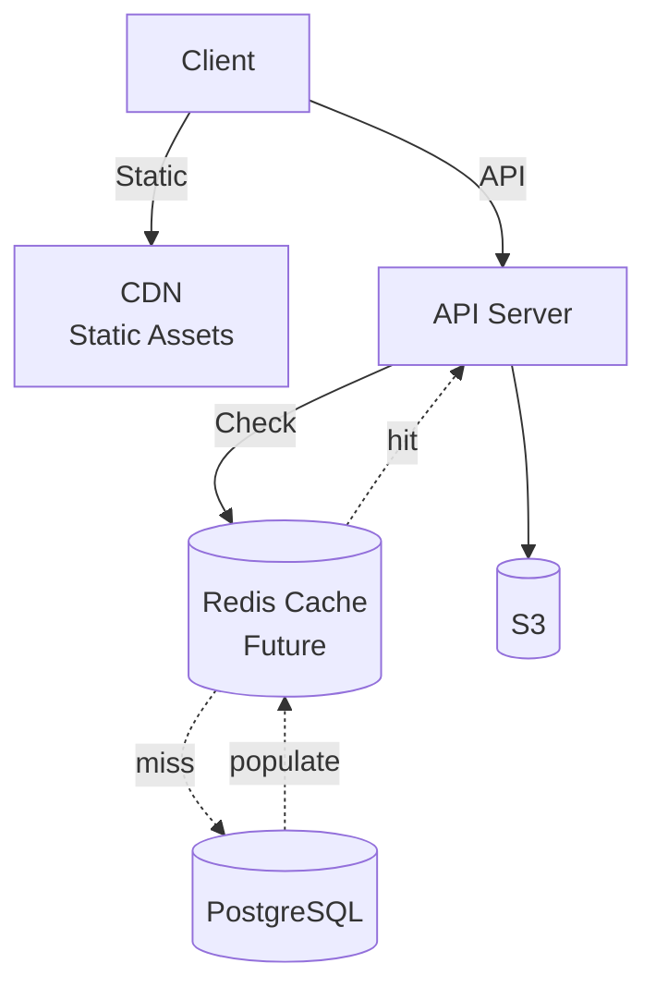

**Current**:
- Database connection pooling (20 connections)
- No application-level caching yet

**Future Enhancements**:
- Redis for session data
- CloudFront CDN for S3 artifacts
- API response caching for read-heavy endpoints

### Scaling Considerations

**Horizontal Scaling**:
```
                    Load Balancer
                         |
        +----------------+----------------+
        |                |                |
    Server 1         Server 2         Server 3
        |                |                |
        +----------------+----------------+
                         |
                  PostgreSQL
                  (Read Replicas)
```

**Bottlenecks**:
1. Claude API rate limits (mitigated by user-provided keys)
2. Database connections (pool of 20, can increase)
3. S3 upload bandwidth (use multipart for large files)
4. WebSocket connections (use sticky sessions with load balancer)

### Performance Metrics

| Operation | Target | Current |
|-----------|--------|---------|
| API Response (p95) | <500ms | ~200ms |
| WebSocket Latency | <100ms | ~50ms |
| DB Query (p95) | <50ms | ~20ms |
| Agent Creation | 20-35min | 25min avg |
| Artifact Upload | <30s | ~15s |

---

## Deployment Architecture

### AWS Deployment

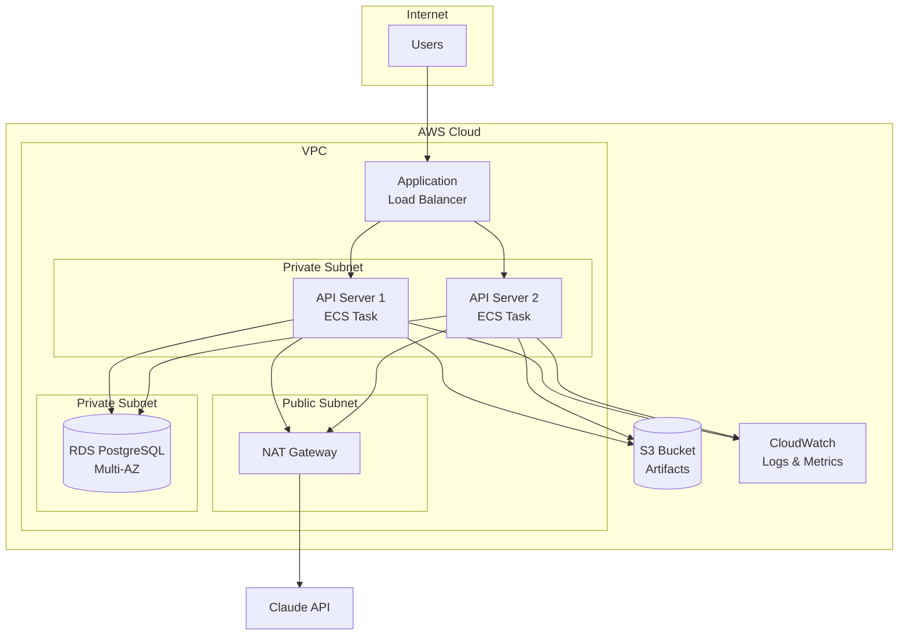

**Key Components**:
- **ECS Fargate**: Serverless containers for API
- **RDS Multi-AZ**: High availability database
- **S3**: Artifact storage with versioning
- **ALB**: SSL termination, WebSocket support
- **CloudWatch**: Centralized logging and monitoring
- **Secrets Manager**: Store JWT_SECRET, ENCRYPTION_KEY

---

## Technology Stack

### Backend
- **Runtime**: Node.js 18+
- **Language**: TypeScript 5.8
- **Framework**: Express.js 4.18
- **Database**: PostgreSQL 15+
- **ORM**: Raw SQL with pg driver
- **WebSocket**: ws library 8.16
- **Authentication**: Passport.js with OAuth2 strategies

### Security
- **Encryption**: Node crypto (AES-256-GCM)
- **JWT**: jsonwebtoken library
- **Security Headers**: Helmet.js
- **Rate Limiting**: express-rate-limit

### Monitoring
- **Logging**: Winston 3.11
- **Metrics**: Prometheus (prom-client)
- **Audit**: Custom PostgreSQL-based audit log

### Storage
- **S3 SDK**: @aws-sdk/client-s3
- **Presigned URLs**: @aws-sdk/s3-request-presigner
- **Multipart Upload**: @aws-sdk/lib-storage

### AI Integration
- **Claude SDK**: @anthropic-ai/sdk 0.30
- **Extended Thinking**: Custom parameter injection
- **Validation**: Zod 3.23

---

## Design Patterns Used

1. **Factory Pattern**: AgentFactory creates specialized agents
2. **Strategy Pattern**: PerformanceOptimizer applies different strategies
3. **Observer Pattern**: WebSocket broadcasts to subscribers
4. **Template Method**: BaseAgent defines lifecycle, subclasses implement
5. **Singleton**: Database connection pool
6. **Dependency Injection**: Constructor injection for testability
7. **Repository Pattern**: SessionStore, UserStore abstract database access

---

## Future Enhancements

1. **Caching Layer**: Redis for session data and API responses
2. **Queue System**: Bull/BullMQ for background job processing
3. **Multi-Region**: Deploy to multiple AWS regions
4. **CDN**: CloudFront for artifact downloads
5. **GraphQL API**: Alternative to REST for complex queries
6. **Real-time Collaboration**: Multiple users on same session
7. **Plugin System**: User-defined agent types and templates
8. **A/B Testing**: Experiment with different prompts and strategies

---

For more details, see:
- [API Documentation](./API.md)
- [Quick Start Guide](./QUICK_START.md)
- [Performance Guide](./PERFORMANCE.md)
- [Security Guide](./SECURITY.md)
