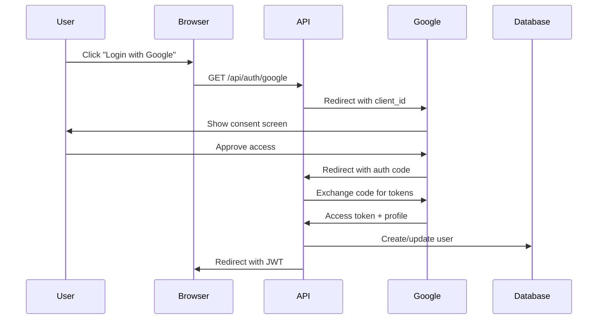

# Security Guide

Comprehensive security best practices, threat mitigation, and compliance guidelines for Agent-Builder.

## Table of Contents
- [Security Overview](#security-overview)
- [Authentication and Authorization](#authentication-and-authorization)
- [Data Encryption](#data-encryption)
- [API Security](#api-security)
- [Rate Limiting](#rate-limiting)
- [Audit Logging](#audit-logging)
- [OWASP Top 10 Compliance](#owasp-top-10-compliance)
- [Incident Response](#incident-response)
- [Security Checklist](#security-checklist)

---

## Security Overview

Agent-Builder implements defense-in-depth with multiple security layers:

```
┌─────────────────────────────────────────┐
│  Layer 7: Application Security          │
│  - Input validation                     │
│  - Output encoding                      │
│  - Authentication/Authorization         │
└─────────────────────────────────────────┘
           ↓
┌─────────────────────────────────────────┐
│  Layer 6: Data Security                 │
│  - Encryption at rest (AES-256-GCM)    │
│  - Encryption in transit (TLS 1.3)     │
└─────────────────────────────────────────┘
           ↓
┌─────────────────────────────────────────┐
│  Layer 5: Network Security              │
│  - WAF rules                            │
│  - Rate limiting                        │
│  - DDoS protection                      │
└─────────────────────────────────────────┘
           ↓
┌─────────────────────────────────────────┐
│  Layer 4: Infrastructure Security       │
│  - VPC isolation                        │
│  - Security groups                      │
│  - Private subnets                      │
└─────────────────────────────────────────┘
```

### Security Principles

1. **Least Privilege**: Minimal permissions by default
2. **Defense in Depth**: Multiple security layers
3. **Fail Securely**: Deny access on errors
4. **Audit Everything**: Comprehensive logging
5. **Zero Trust**: Verify every request

---

## Authentication and Authorization

### SSO-Only Authentication

Agent-Builder uses SSO (OAuth 2.0) exclusively - no local passwords.

**Supported Providers**:
- Google OAuth 2.0
- Azure Active Directory
- Okta OpenID Connect

**Why SSO-Only?**
- No password storage
- Leverage enterprise identity management
- Multi-factor authentication (MFA) through provider
- Centralized user provisioning/de-provisioning

### OAuth 2.0 Flow



### JWT Token Security

**Token Structure**:
```json
{
  "alg": "HS256",
  "typ": "JWT"
}
{
  "userId": "uuid",
  "email": "user@example.com",
  "name": "User Name",
  "iat": 1707217200,
  "exp": 1707822000,
  "iss": "agent-builder"
}
```

**Security Measures**:
1. **Secret Rotation**: Rotate JWT_SECRET quarterly
2. **Short Expiration**: 7-day default (configurable)
3. **Secure Storage**: Never store plaintext tokens
4. **Hash Storage**: SHA-256 hash in database
5. **Constant-Time Comparison**: Prevent timing attacks

**Token Storage in Database**:
```typescript
import { createHash } from 'crypto';

function hashToken(token: string): string {
  return createHash('sha256')
    .update(token)
    .digest('hex');
}

// Store only the hash
await db.query(
  'INSERT INTO user_sessions (user_id, token_hash, expires_at) VALUES ($1, $2, $3)',
  [userId, hashToken(token), expiresAt]
);
```

**Constant-Time Comparison**:
```typescript
import { timingSafeEqual } from 'crypto';

function compareTokens(a: string, b: string): boolean {
  if (a.length !== b.length) return false;

  const bufA = Buffer.from(a);
  const bufB = Buffer.from(b);

  return timingSafeEqual(bufA, bufB);
}
```

### Authorization Model

**Resource Ownership**:
- Users can only access their own sessions
- Users can only manage their own API keys
- Admin endpoints (future): Role-based access control

**Enforcement**:
```typescript
// Check ownership before any operation
const session = await sessionStore.getById(sessionId);

if (session.user_id !== req.user.userId) {
  throw new AuthorizationError('Access denied');
}
```

---

## Data Encryption

### Encryption at Rest

**API Keys** (AES-256-GCM):

```typescript
import { randomBytes, createCipheriv, createDecipheriv } from 'crypto';

const ALGORITHM = 'aes-256-gcm';
const KEY_LENGTH = 32;
const IV_LENGTH = 16;
const AUTH_TAG_LENGTH = 16;

export function encrypt(plaintext: string): EncryptedData {
  // Derive key from base64-encoded environment variable
  const key = Buffer.from(process.env.ENCRYPTION_KEY!, 'base64');

  // Generate random IV (never reuse)
  const iv = randomBytes(IV_LENGTH);

  // Create cipher
  const cipher = createCipheriv(ALGORITHM, key, iv);

  // Encrypt
  const encrypted = Buffer.concat([
    cipher.update(plaintext, 'utf8'),
    cipher.final()
  ]);

  // Get authentication tag (integrity check)
  const authTag = cipher.getAuthTag();

  return {
    encrypted: encrypted.toString('base64'),
    iv: iv.toString('hex'),
    authTag: authTag.toString('hex')
  };
}

export function decrypt(data: EncryptedData): string {
  const key = Buffer.from(process.env.ENCRYPTION_KEY!, 'base64');
  const iv = Buffer.from(data.iv, 'hex');
  const authTag = Buffer.from(data.authTag, 'hex');
  const encrypted = Buffer.from(data.encrypted, 'base64');

  const decipher = createDecipheriv(ALGORITHM, key, iv);
  decipher.setAuthTag(authTag);

  const decrypted = Buffer.concat([
    decipher.update(encrypted),
    decipher.final()
  ]);

  return decrypted.toString('utf8');
}
```

**Why AES-256-GCM?**
- **AES-256**: Industry-standard symmetric encryption
- **GCM Mode**: Authenticated encryption (prevents tampering)
- **Random IV**: Unique per encryption (prevents pattern analysis)
- **Authentication Tag**: Ensures data integrity

**Key Management**:
- Store in AWS Secrets Manager (production)
- Never commit to version control
- Rotate annually or after breach
- Generate with high-entropy source:
  ```bash
  node -e "console.log(require('crypto').randomBytes(32).toString('base64'))"
  ```

### Encryption in Transit

**TLS 1.3** (enforced in production):

```typescript
// ALB configuration (AWS)
{
  "SslPolicy": "ELBSecurityPolicy-TLS13-1-2-2021-06",
  "Certificates": [
    {
      "CertificateArn": "arn:aws:acm:..."
    }
  ]
}
```

**HSTS Headers** (via Helmet.js):
```typescript
app.use(helmet({
  hsts: {
    maxAge: 31536000,        // 1 year
    includeSubDomains: true,
    preload: true
  }
}));
```

**Certificate Pinning** (optional for high-security):
```typescript
import https from 'https';

const options = {
  hostname: 'api.anthropic.com',
  port: 443,
  path: '/v1/messages',
  method: 'POST',
  // Pin certificate fingerprint
  checkServerIdentity: (host, cert) => {
    const fingerprint = cert.fingerprint;
    const expected = 'XX:YY:ZZ:...'; // Expected fingerprint

    if (fingerprint !== expected) {
      throw new Error('Certificate fingerprint mismatch');
    }
  }
};
```

---

## API Security

### Input Validation

**Zod Schemas** for request validation:

```typescript
import { z } from 'zod';

const CreateAgentSchema = z.object({
  description: z.string()
    .min(10, 'Description must be at least 10 characters')
    .max(1000, 'Description too long'),
  outputType: z.enum(['skill', 'mcp', 'cli', 'library']),
  language: z.enum(['typescript', 'python']),
  interactive: z.boolean().optional()
});

// Middleware
export function validateBody(schema: z.ZodSchema) {
  return (req, res, next) => {
    try {
      req.body = schema.parse(req.body);
      next();
    } catch (error) {
      if (error instanceof z.ZodError) {
        res.status(400).json({
          error: 'Validation Error',
          details: error.errors
        });
      } else {
        next(error);
      }
    }
  };
}

// Usage
router.post('/create',
  validateBody(CreateAgentSchema),
  createAgentHandler
);
```

**SQL Injection Prevention**:

```typescript
// ALWAYS use parameterized queries
// ✓ SAFE
await db.query(
  'SELECT * FROM users WHERE email = $1',
  [userEmail]
);

// ✗ UNSAFE - Never concatenate
// await db.query(`SELECT * FROM users WHERE email = '${userEmail}'`);
```

**XSS Prevention**:

```typescript
// Output encoding (automatic with JSON responses)
res.json({ message: userInput }); // Automatically escaped

// For HTML responses (if any)
import he from 'he';
const safe = he.encode(userInput);
```

### Security Headers (Helmet.js)

```typescript
app.use(helmet({
  contentSecurityPolicy: {
    directives: {
      defaultSrc: ["'self'"],
      scriptSrc: ["'self'"],
      styleSrc: ["'self'", "'unsafe-inline'"], // Minimal unsafe-inline
      imgSrc: ["'self'", 'data:', 'https:'],
      connectSrc: ["'self'", 'ws:', 'wss:'],
      fontSrc: ["'self'"],
      objectSrc: ["'none'"],
      mediaSrc: ["'self'"],
      frameSrc: ["'none'"]
    }
  },
  hsts: {
    maxAge: 31536000,
    includeSubDomains: true,
    preload: true
  },
  noSniff: true,           // X-Content-Type-Options: nosniff
  frameguard: {            // X-Frame-Options: DENY
    action: 'deny'
  },
  xssFilter: true,         // X-XSS-Protection: 1; mode=block
  referrerPolicy: {
    policy: 'strict-origin-when-cross-origin'
  }
}));
```

### CORS Configuration

```typescript
const corsOptions = {
  origin: (origin, callback) => {
    const allowedOrigins = process.env.ALLOWED_ORIGINS?.split(',') || [];

    // Allow requests with no origin (mobile apps, curl)
    if (!origin) return callback(null, true);

    if (allowedOrigins.includes(origin)) {
      callback(null, true);
    } else {
      callback(new Error('Not allowed by CORS'));
    }
  },
  credentials: true,        // Allow cookies/auth headers
  optionsSuccessStatus: 200,
  maxAge: 86400            // Cache preflight for 24 hours
};

app.use(cors(corsOptions));
```

---

## Rate Limiting

### Multi-Tier Rate Limits

```typescript
import rateLimit from 'express-rate-limit';

// Standard endpoints
export const rateLimitMiddleware = rateLimit({
  windowMs: 15 * 60 * 1000,  // 15 minutes
  max: 100,                   // 100 requests per window
  message: {
    error: 'Too Many Requests',
    message: 'Rate limit exceeded. Please try again later.'
  },
  standardHeaders: true,      // Return rate limit info in headers
  legacyHeaders: false,       // Disable X-RateLimit-* headers
  keyGenerator: (req) => {
    // Use user ID if authenticated, otherwise IP
    return req.user?.userId || req.ip || 'unknown';
  }
});

// Strict rate limiting (auth, API keys)
export const strictRateLimitMiddleware = rateLimit({
  windowMs: 15 * 60 * 1000,
  max: 10,                    // Only 10 requests per 15 minutes
  skipSuccessfulRequests: false
});

// Agent creation rate limiting
export const agentCreationRateLimitMiddleware = rateLimit({
  windowMs: 60 * 60 * 1000,  // 1 hour
  max: 10,                    // 10 agents per hour per user
  keyGenerator: (req) => req.user!.userId,
  skipFailedRequests: true    // Don't count failed attempts
});

// Download rate limiting
export const downloadRateLimitMiddleware = rateLimit({
  windowMs: 15 * 60 * 1000,
  max: 50,                    // 50 downloads per 15 minutes
  keyGenerator: (req) => req.user!.userId
});
```

### Adaptive Rate Limiting (Future)

Adjust limits based on user reputation:

```typescript
function adaptiveRateLimit(req, res, next) {
  const user = req.user;

  // Calculate user reputation
  const successRate = user.successfulSessions / user.totalSessions;
  const accountAge = Date.now() - user.createdAt.getTime();

  // Higher limits for good actors
  let maxRequests = 100;
  if (successRate > 0.9 && accountAge > 30 * 24 * 60 * 60 * 1000) {
    maxRequests = 200; // Double limit for trusted users
  }

  // Apply limit
  // ...
}
```

### DDoS Protection

**AWS Shield** (Standard - free):
- Protection against common layer 3/4 attacks
- Always-on detection and mitigation

**AWS WAF** (optional):
```json
{
  "Name": "RateLimitRule",
  "Priority": 1,
  "Statement": {
    "RateBasedStatement": {
      "Limit": 2000,
      "AggregateKeyType": "IP"
    }
  },
  "Action": {
    "Block": {}
  }
}
```

---

## Audit Logging

### What to Log

**Authentication Events**:
- Login attempts (success/failure)
- Logout (single device / all devices)
- Token refresh
- Session expiration

**User Actions**:
- API key added/validated/deleted
- Agent creation started
- Session viewed/cancelled/deleted
- Artifacts downloaded

**Security Events**:
- Rate limit violations
- Authorization failures (access to other user's resources)
- Invalid tokens
- Suspicious patterns

### Audit Log Structure

```typescript
interface AuditLogEntry {
  id: bigint;
  user_id?: string;
  session_id?: string;
  event_type: string;
  ip_address?: string;
  user_agent?: string;
  details: Record<string, any>;
  created_at: Date;
}
```

### Implementation

```typescript
// src/server/monitoring/audit.ts
import { query } from '../storage/database';

export class AuditLogger {
  async log(entry: Omit<AuditLogEntry, 'id' | 'created_at'>) {
    await query(
      `INSERT INTO audit_log
       (user_id, session_id, event_type, ip_address, user_agent, details)
       VALUES ($1, $2, $3, $4, $5, $6)`,
      [
        entry.user_id || null,
        entry.session_id || null,
        entry.event_type,
        entry.ip_address || null,
        entry.user_agent || null,
        entry.details || {}
      ]
    );
  }

  async login(userId: string, provider: string, ip: string) {
    await this.log({
      user_id: userId,
      event_type: 'login',
      ip_address: ip,
      details: { provider }
    });
  }

  async unauthorizedAccess(userId: string | undefined, resource: string, ip: string) {
    await this.log({
      user_id: userId,
      event_type: 'unauthorized_access',
      ip_address: ip,
      details: { resource, severity: 'high' }
    });
  }

  async rateLimitViolation(userId: string | undefined, endpoint: string, ip: string) {
    await this.log({
      user_id: userId,
      event_type: 'rate_limit_violation',
      ip_address: ip,
      details: { endpoint }
    });
  }
}

export const audit = new AuditLogger();
```

### Audit Log Queries

**Recent security events**:
```sql
SELECT * FROM audit_log
WHERE event_type IN ('unauthorized_access', 'rate_limit_violation', 'login_failed')
  AND created_at > NOW() - INTERVAL '24 hours'
ORDER BY created_at DESC;
```

**User activity summary**:
```sql
SELECT
  user_id,
  COUNT(*) FILTER (WHERE event_type = 'login') AS logins,
  COUNT(*) FILTER (WHERE event_type LIKE '%_failed') AS failures,
  COUNT(*) FILTER (WHERE event_type = 'create_session') AS agents_created
FROM audit_log
WHERE created_at > NOW() - INTERVAL '7 days'
GROUP BY user_id;
```

---

## OWASP Top 10 Compliance

### A01:2021 - Broken Access Control

**Mitigation**:
- Enforce authorization checks on all protected resources
- Deny access by default
- Check resource ownership before operations
- No direct object references (use UUIDs)

**Implementation**:
```typescript
// Authorization middleware
async function checkOwnership(req, res, next) {
  const resourceId = req.params.id;
  const userId = req.user!.userId;

  const resource = await getResource(resourceId);

  if (!resource) {
    return res.status(404).json({ error: 'Not found' });
  }

  if (resource.user_id !== userId) {
    await audit.unauthorizedAccess(userId, resourceId, req.ip);
    return res.status(403).json({ error: 'Access denied' });
  }

  next();
}
```

### A02:2021 - Cryptographic Failures

**Mitigation**:
- AES-256-GCM for data at rest
- TLS 1.3 for data in transit
- Secure key management (Secrets Manager)
- No hardcoded secrets

### A03:2021 - Injection

**Mitigation**:
- Parameterized queries (no string concatenation)
- Input validation with Zod schemas
- Output encoding
- Principle of least privilege for database users

### A04:2021 - Insecure Design

**Mitigation**:
- Threat modeling performed
- Security requirements documented
- Defense in depth architecture
- Secure development lifecycle

### A05:2021 - Security Misconfiguration

**Mitigation**:
- Security headers via Helmet.js
- Minimal error information in production
- Disabled unnecessary features
- Regular dependency updates

```typescript
// Error handling - no stack traces in production
app.use((err, req, res, next) => {
  logger.error('Request failed', { error: err, stack: err.stack });

  const response = {
    error: err.name || 'Internal Server Error',
    message: err.message || 'An error occurred'
  };

  // Only include stack in development
  if (process.env.NODE_ENV !== 'production') {
    response.stack = err.stack;
  }

  res.status(err.statusCode || 500).json(response);
});
```

### A06:2021 - Vulnerable and Outdated Components

**Mitigation**:
- Regular dependency updates (`npm audit`)
- Automated security scanning (Dependabot, Snyk)
- Minimal dependencies
- Version pinning in package.json

```bash
# Check for vulnerabilities
npm audit

# Fix automatically (if possible)
npm audit fix

# Review and update
npm outdated
npm update
```

### A07:2021 - Identification and Authentication Failures

**Mitigation**:
- SSO-only authentication (no passwords)
- MFA through identity provider
- Strong session management (JWT with short expiration)
- Rate limiting on authentication endpoints

### A08:2021 - Software and Data Integrity Failures

**Mitigation**:
- CI/CD pipeline with integrity checks
- Signed Docker images
- Dependency integrity verification (package-lock.json)
- Immutable infrastructure

### A09:2021 - Security Logging and Monitoring Failures

**Mitigation**:
- Comprehensive audit logging
- Centralized log management (CloudWatch)
- Real-time alerting on security events
- Regular log review

### A10:2021 - Server-Side Request Forgery (SSRF)

**Mitigation**:
- No user-controlled URLs
- Whitelist allowed domains
- Network segmentation (private subnets)

---

## Incident Response

### Incident Classification

| Severity | Description | Response Time | Examples |
|----------|-------------|---------------|----------|
| Critical | Data breach, service down | Immediate | Exposed API keys, database breach |
| High | Security vulnerability | 4 hours | Authentication bypass, XSS |
| Medium | Performance degradation | 24 hours | Rate limit misconfiguration |
| Low | Minor issue | 1 week | Outdated dependency |

### Response Procedure

1. **Detection and Triage**
   - Alert received (monitoring system, user report)
   - Assess severity and impact
   - Notify response team

2. **Containment**
   - Isolate affected systems
   - Revoke compromised credentials
   - Enable additional logging

3. **Eradication**
   - Identify root cause
   - Remove malicious code/access
   - Patch vulnerabilities

4. **Recovery**
   - Restore from clean backups
   - Verify system integrity
   - Monitor for recurrence

5. **Post-Incident**
   - Document incident timeline
   - Root cause analysis
   - Update security controls
   - Team debrief

### Breach Response Plan

**If API keys are exposed**:
```bash
# 1. Immediately rotate JWT_SECRET
aws secretsmanager update-secret \
  --secret-id agent-builder/jwt-secret \
  --secret-string "$(node -e "...")"

# 2. Invalidate all sessions
psql -c "TRUNCATE user_sessions;"

# 3. Notify affected users
# 4. Force re-authentication
```

**If database is compromised**:
```bash
# 1. Isolate database (security group)
aws ec2 revoke-security-group-ingress \
  --group-id sg-db-xxxxxxxx

# 2. Take snapshot
aws rds create-db-snapshot \
  --db-instance-identifier agent-builder-db \
  --db-snapshot-identifier breach-$(date +%Y%m%d)

# 3. Restore from last known good backup
# 4. Forensic analysis on compromised instance
# 5. Notify users of breach
```

---

## Security Checklist

### Development
- [ ] No secrets in code or version control
- [ ] Input validation on all endpoints
- [ ] Parameterized database queries
- [ ] Error handling without stack traces in prod
- [ ] Security headers configured
- [ ] CORS properly configured
- [ ] Dependencies up to date

### Deployment
- [ ] HTTPS enforced
- [ ] Secrets in Secrets Manager
- [ ] Database in private subnet
- [ ] Security groups configured (least privilege)
- [ ] WAF rules enabled
- [ ] Logging enabled
- [ ] Monitoring and alerts configured
- [ ] Backup and recovery tested

### Operations
- [ ] Regular security audits
- [ ] Dependency updates (monthly)
- [ ] Log review (weekly)
- [ ] Penetration testing (annually)
- [ ] Incident response plan tested
- [ ] Team security training
- [ ] Access review (quarterly)

### Compliance
- [ ] GDPR compliance (if applicable)
- [ ] SOC 2 controls (if applicable)
- [ ] Data retention policies
- [ ] Privacy policy published
- [ ] Terms of service published

---

For more details, see:
- [API Documentation](./API.md)
- [Deployment Guide](./DEPLOYMENT.md)
- [Troubleshooting Guide](./TROUBLESHOOTING.md)
- [Architecture Guide](./ARCHITECTURE_ENHANCED.md)
