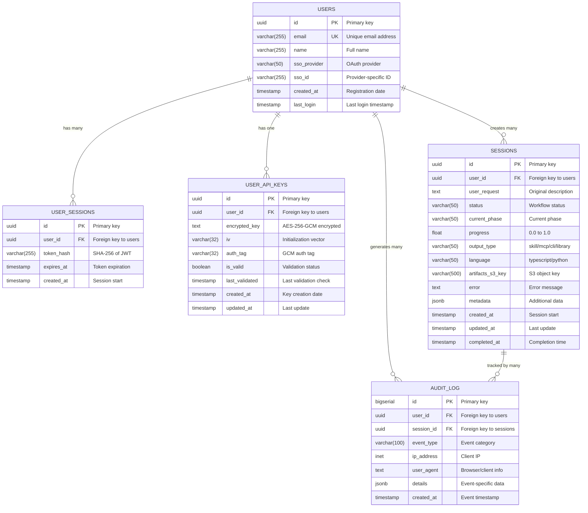

# Database Schema Documentation

Complete documentation of the PostgreSQL database schema for Agent-Builder.

## Entity Relationship Diagram



## Table Descriptions

### users

Stores user account information for SSO authentication.

| Column | Type | Constraints | Description |
|--------|------|-------------|-------------|
| `id` | UUID | PRIMARY KEY | Auto-generated unique identifier |
| `email` | VARCHAR(255) | UNIQUE, NOT NULL | User's email address (from OAuth) |
| `name` | VARCHAR(255) | NULL | User's full name (from OAuth) |
| `sso_provider` | VARCHAR(50) | NULL | OAuth provider: 'google', 'azure', 'okta' |
| `sso_id` | VARCHAR(255) | NULL | Provider-specific user ID |
| `created_at` | TIMESTAMP | DEFAULT NOW() | Account creation timestamp |
| `last_login` | TIMESTAMP | NULL | Last successful login |

**Indexes:**
- `idx_users_email` on `email`
- `idx_users_sso_id` on `(sso_provider, sso_id)`

**Constraints:**
- Email format validation: `email ~* '^[A-Za-z0-9._%+-]+@[A-Za-z0-9.-]+\.[A-Za-z]{2,}$'`

**Example:**
```sql
SELECT * FROM users WHERE email = 'user@example.com';
```

### user_sessions

Manages JWT token sessions for authentication.

| Column | Type | Constraints | Description |
|--------|------|-------------|-------------|
| `id` | UUID | PRIMARY KEY | Session identifier |
| `user_id` | UUID | FOREIGN KEY, NOT NULL | Reference to users table |
| `token_hash` | VARCHAR(255) | NOT NULL | SHA-256 hash of JWT token |
| `expires_at` | TIMESTAMP | NOT NULL | Token expiration time |
| `created_at` | TIMESTAMP | DEFAULT NOW() | Session creation time |

**Indexes:**
- `idx_user_sessions_user_id` on `user_id`
- `idx_user_sessions_token_hash` on `token_hash`
- `idx_user_sessions_expires_at` on `expires_at`

**Constraints:**
- `expires_at > created_at` (valid expiration check)
- `ON DELETE CASCADE` for `user_id` (delete sessions when user is deleted)

**Example:**
```sql
-- Find active sessions for a user
SELECT * FROM user_sessions
WHERE user_id = '550e8400-e29b-41d4-a716-446655440000'
  AND expires_at > NOW();
```

### user_api_keys

Stores encrypted Anthropic API keys for users.

| Column | Type | Constraints | Description |
|--------|------|-------------|-------------|
| `id` | UUID | PRIMARY KEY | Key record identifier |
| `user_id` | UUID | FOREIGN KEY, NOT NULL | Reference to users table |
| `encrypted_key` | TEXT | NOT NULL | AES-256-GCM encrypted API key |
| `iv` | VARCHAR(32) | NOT NULL | Initialization vector (hex) |
| `auth_tag` | VARCHAR(32) | NOT NULL | GCM authentication tag (hex) |
| `is_valid` | BOOLEAN | DEFAULT TRUE | Validation status |
| `last_validated` | TIMESTAMP | NULL | Last successful validation |
| `created_at` | TIMESTAMP | DEFAULT NOW() | Key creation time |
| `updated_at` | TIMESTAMP | DEFAULT NOW() | Last update time |

**Indexes:**
- `idx_user_api_keys_user_id` on `user_id`

**Constraints:**
- `ON DELETE CASCADE` for `user_id`
- Only one API key per user (enforced at application level)

**Encryption Details:**
- **Algorithm**: AES-256-GCM
- **Key Source**: Environment variable `ENCRYPTION_KEY`
- **IV**: Random 16-byte value (hex encoded)
- **Auth Tag**: 16-byte authentication tag (hex encoded)

**Example:**
```sql
-- Check if user has valid API key
SELECT is_valid, last_validated
FROM user_api_keys
WHERE user_id = '550e8400-e29b-41d4-a716-446655440000';
```

### sessions

Tracks agent creation sessions and their progress.

| Column | Type | Constraints | Description |
|--------|------|-------------|-------------|
| `id` | UUID | PRIMARY KEY | Session identifier |
| `user_id` | UUID | FOREIGN KEY, NOT NULL | Reference to users table |
| `user_request` | TEXT | NOT NULL | Original agent description |
| `status` | VARCHAR(50) | NOT NULL | pending/in_progress/completed/failed/cancelled |
| `current_phase` | VARCHAR(50) | NULL | clarification/design/implementation/packaging/learning |
| `progress` | FLOAT | DEFAULT 0.0 | Progress from 0.0 to 1.0 |
| `output_type` | VARCHAR(50) | NULL | skill/mcp/cli/library |
| `language` | VARCHAR(50) | NULL | typescript/python |
| `artifacts_s3_key` | VARCHAR(500) | NULL | S3 object key for artifacts |
| `error` | TEXT | NULL | Error message if failed |
| `metadata` | JSONB | NULL | Additional session data |
| `created_at` | TIMESTAMP | DEFAULT NOW() | Session creation |
| `updated_at` | TIMESTAMP | DEFAULT NOW() | Last update |
| `completed_at` | TIMESTAMP | NULL | Completion timestamp |

**Indexes:**
- `idx_sessions_user_id` on `user_id`
- `idx_sessions_status` on `status`
- `idx_sessions_created_at` on `created_at DESC`
- `idx_sessions_completed_at` on `completed_at DESC NULLS LAST`

**Constraints:**
- Valid status enum
- Valid phase enum
- Progress between 0.0 and 1.0
- Valid output_type enum
- Valid language enum
- `ON DELETE CASCADE` for `user_id`

**Metadata Structure:**
```json
{
  "requirements": {
    "functional": ["requirement 1", "requirement 2"],
    "technical": {"constraint": "value"}
  },
  "design": {
    "components": [],
    "decisions": []
  },
  "thinking_trace": "...",
  "startedAt": "2026-02-09T10:00:00Z"
}
```

**Example:**
```sql
-- Get active sessions
SELECT id, user_request, current_phase, progress
FROM sessions
WHERE status = 'in_progress'
ORDER BY created_at DESC;

-- Get user's completed sessions
SELECT * FROM sessions
WHERE user_id = '550e8400-e29b-41d4-a716-446655440000'
  AND status = 'completed'
ORDER BY completed_at DESC
LIMIT 10;
```

### audit_log

Comprehensive audit trail for security and compliance.

| Column | Type | Constraints | Description |
|--------|------|-------------|-------------|
| `id` | BIGSERIAL | PRIMARY KEY | Sequential log entry ID |
| `user_id` | UUID | FOREIGN KEY, NULL | Reference to users (nullable) |
| `session_id` | UUID | FOREIGN KEY, NULL | Reference to sessions (nullable) |
| `event_type` | VARCHAR(100) | NOT NULL | Event category |
| `ip_address` | INET | NULL | Client IP address |
| `user_agent` | TEXT | NULL | Browser/client string |
| `details` | JSONB | NULL | Event-specific details |
| `created_at` | TIMESTAMP | DEFAULT NOW() | Event timestamp |

**Indexes:**
- `idx_audit_log_user_id` on `user_id`
- `idx_audit_log_session_id` on `session_id`
- `idx_audit_log_event_type` on `event_type`
- `idx_audit_log_created_at` on `created_at DESC`

**Constraints:**
- `ON DELETE SET NULL` for `user_id` and `session_id` (preserve audit trail)

**Event Types:**
- `login` - User logged in
- `logout` - User logged out
- `logout_all` - Logged out from all devices
- `session_created` - New agent creation session
- `session_completed` - Session finished successfully
- `session_failed` - Session failed with error
- `session_cancelled` - User cancelled session
- `session_deleted` - Session deleted by user
- `api_key_added` - API key stored
- `api_key_updated` - API key updated
- `api_key_deleted` - API key removed
- `api_key_validated` - API key validation attempted
- `api_key_validation_failed` - Validation failed
- `download_artifacts` - User downloaded artifacts

**Example:**
```sql
-- Get recent activity for a user
SELECT event_type, details, created_at
FROM audit_log
WHERE user_id = '550e8400-e29b-41d4-a716-446655440000'
ORDER BY created_at DESC
LIMIT 50;

-- Get session audit trail
SELECT event_type, details, created_at
FROM audit_log
WHERE session_id = '123e4567-e89b-12d3-a456-426614174000'
ORDER BY created_at ASC;

-- Security audit: failed login attempts
SELECT user_id, ip_address, COUNT(*) as attempts
FROM audit_log
WHERE event_type = 'api_key_validation_failed'
  AND created_at > NOW() - INTERVAL '1 hour'
GROUP BY user_id, ip_address
HAVING COUNT(*) > 5;
```

## Database Functions

### update_updated_at_column()

Automatically updates the `updated_at` timestamp on row updates.

```sql
CREATE OR REPLACE FUNCTION update_updated_at_column()
RETURNS TRIGGER AS $$
BEGIN
    NEW.updated_at = NOW();
    RETURN NEW;
END;
$$ LANGUAGE plpgsql;
```

**Applied to:**
- `user_api_keys` table
- `sessions` table

**Usage:**
```sql
CREATE TRIGGER update_user_api_keys_updated_at
BEFORE UPDATE ON user_api_keys
FOR EACH ROW EXECUTE FUNCTION update_updated_at_column();
```

## Common Queries

### User Management

```sql
-- Create new user (typically done via OAuth)
INSERT INTO users (email, name, sso_provider, sso_id)
VALUES ('user@example.com', 'John Doe', 'google', 'google-id-123')
RETURNING id;

-- Update last login
UPDATE users
SET last_login = NOW()
WHERE id = '550e8400-e29b-41d4-a716-446655440000';

-- Get user with session info
SELECT
  u.*,
  COUNT(s.id) as total_sessions,
  COUNT(CASE WHEN s.status = 'completed' THEN 1 END) as completed_sessions
FROM users u
LEFT JOIN sessions s ON u.id = s.user_id
WHERE u.id = '550e8400-e29b-41d4-a716-446655440000'
GROUP BY u.id;
```

### Session Management

```sql
-- Create new session
INSERT INTO sessions (
  user_id, user_request, status, output_type, language, metadata
)
VALUES (
  '550e8400-e29b-41d4-a716-446655440000',
  'A web scraper for e-commerce',
  'pending',
  'mcp',
  'typescript',
  '{"startedAt": "2026-02-09T10:00:00Z"}'::jsonb
)
RETURNING id;

-- Update session progress
UPDATE sessions
SET current_phase = 'implementation',
    progress = 0.6,
    updated_at = NOW()
WHERE id = '123e4567-e89b-12d3-a456-426614174000';

-- Mark session as completed
UPDATE sessions
SET status = 'completed',
    progress = 1.0,
    artifacts_s3_key = 'sessions/123e4567.../artifacts.zip',
    completed_at = NOW()
WHERE id = '123e4567-e89b-12d3-a456-426614174000';

-- Get session statistics
SELECT
  COUNT(*) as total,
  COUNT(CASE WHEN status = 'completed' THEN 1 END) as completed,
  COUNT(CASE WHEN status = 'failed' THEN 1 END) as failed,
  COUNT(CASE WHEN status IN ('pending', 'in_progress') THEN 1 END) as in_progress,
  AVG(EXTRACT(EPOCH FROM (completed_at - created_at)) / 60) as avg_duration_minutes
FROM sessions
WHERE user_id = '550e8400-e29b-41d4-a716-446655440000'
  AND completed_at IS NOT NULL;
```

### Audit & Compliance

```sql
-- Log event
INSERT INTO audit_log (user_id, session_id, event_type, ip_address, details)
VALUES (
  '550e8400-e29b-41d4-a716-446655440000',
  '123e4567-e89b-12d3-a456-426614174000',
  'session_created',
  '192.168.1.1',
  '{"description": "Web scraper", "output_type": "mcp"}'::jsonb
);

-- Find suspicious activity
SELECT
  user_id,
  event_type,
  COUNT(*) as count,
  array_agg(DISTINCT ip_address::text) as ips
FROM audit_log
WHERE created_at > NOW() - INTERVAL '24 hours'
GROUP BY user_id, event_type
HAVING COUNT(*) > 100
ORDER BY count DESC;

-- Compliance report
SELECT
  DATE(created_at) as date,
  event_type,
  COUNT(*) as events
FROM audit_log
WHERE created_at BETWEEN '2026-02-01' AND '2026-02-28'
GROUP BY DATE(created_at), event_type
ORDER BY date DESC, events DESC;
```

## Database Maintenance

### Cleanup Expired Sessions

```sql
-- Delete expired JWT sessions
DELETE FROM user_sessions
WHERE expires_at < NOW() - INTERVAL '7 days';
```

### Archive Old Sessions

```sql
-- Move old sessions to archive table
INSERT INTO sessions_archive
SELECT * FROM sessions
WHERE completed_at < NOW() - INTERVAL '90 days';

DELETE FROM sessions
WHERE completed_at < NOW() - INTERVAL '90 days';
```

### Vacuum and Analyze

```sql
-- Regular maintenance
VACUUM ANALYZE sessions;
VACUUM ANALYZE audit_log;
```

## Performance Tuning

### Index Usage Analysis

```sql
-- Check index usage
SELECT
  schemaname,
  tablename,
  indexname,
  idx_scan,
  idx_tup_read,
  idx_tup_fetch
FROM pg_stat_user_indexes
WHERE schemaname = 'public'
ORDER BY idx_scan DESC;
```

### Query Performance

```sql
-- Slow query analysis
SELECT
  query,
  calls,
  total_time,
  mean_time,
  max_time
FROM pg_stat_statements
WHERE query LIKE '%sessions%'
ORDER BY total_time DESC
LIMIT 10;
```

### Table Size Monitoring

```sql
-- Check table sizes
SELECT
  tablename,
  pg_size_pretty(pg_total_relation_size(schemaname||'.'||tablename)) as size
FROM pg_tables
WHERE schemaname = 'public'
ORDER BY pg_total_relation_size(schemaname||'.'||tablename) DESC;
```

## Backup & Recovery

### Backup Strategy

```sql
-- Full backup
pg_dump -h localhost -U postgres -d agentbuilder -F c -f backup.dump

-- Schema only
pg_dump -h localhost -U postgres -d agentbuilder --schema-only -f schema.sql

-- Data only
pg_dump -h localhost -U postgres -d agentbuilder --data-only -f data.sql
```

### Point-in-Time Recovery

```sql
-- Restore to specific point
pg_restore -h localhost -U postgres -d agentbuilder -c backup.dump
```

## Security Considerations

### Row-Level Security (RLS)

```sql
-- Enable RLS on sessions
ALTER TABLE sessions ENABLE ROW LEVEL SECURITY;

-- Users can only see their own sessions
CREATE POLICY session_isolation ON sessions
  FOR ALL
  USING (user_id = current_setting('app.current_user_id')::uuid);
```

### Sensitive Data Encryption

API keys are encrypted at the application level using:
- **Algorithm**: AES-256-GCM
- **Key Management**: AWS Secrets Manager
- **Key Rotation**: Quarterly

### Access Control

```sql
-- Read-only user for reporting
CREATE ROLE readonly_user;
GRANT CONNECT ON DATABASE agentbuilder TO readonly_user;
GRANT USAGE ON SCHEMA public TO readonly_user;
GRANT SELECT ON ALL TABLES IN SCHEMA public TO readonly_user;

-- Application user with limited permissions
CREATE ROLE app_user;
GRANT CONNECT ON DATABASE agentbuilder TO app_user;
GRANT USAGE ON SCHEMA public TO app_user;
GRANT SELECT, INSERT, UPDATE, DELETE ON ALL TABLES IN SCHEMA public TO app_user;
GRANT USAGE ON ALL SEQUENCES IN SCHEMA public TO app_user;
```

## Migration Strategy

### Schema Versioning

Migrations are managed using numbered SQL files:

```
migrations/
├── 001_initial_schema.sql
├── 002_add_metadata_column.sql
├── 003_add_indexes.sql
└── ...
```

### Running Migrations

```bash
# Apply all pending migrations
npm run migrate

# Rollback last migration
npm run migrate:rollback

# Check migration status
npm run migrate:status
```

## Monitoring

### Key Metrics

```sql
-- Active sessions
SELECT COUNT(*) FROM sessions
WHERE status IN ('pending', 'in_progress');

-- Sessions per hour
SELECT
  DATE_TRUNC('hour', created_at) as hour,
  COUNT(*) as sessions
FROM sessions
WHERE created_at > NOW() - INTERVAL '24 hours'
GROUP BY hour
ORDER BY hour DESC;

-- Average session duration
SELECT
  output_type,
  AVG(EXTRACT(EPOCH FROM (completed_at - created_at)) / 60) as avg_minutes
FROM sessions
WHERE status = 'completed'
  AND completed_at > NOW() - INTERVAL '7 days'
GROUP BY output_type;
```

### Health Checks

```sql
-- Database connection test
SELECT 1;

-- Table health
SELECT
  tablename,
  n_live_tup,
  n_dead_tup,
  last_vacuum,
  last_analyze
FROM pg_stat_user_tables
WHERE schemaname = 'public';
```
