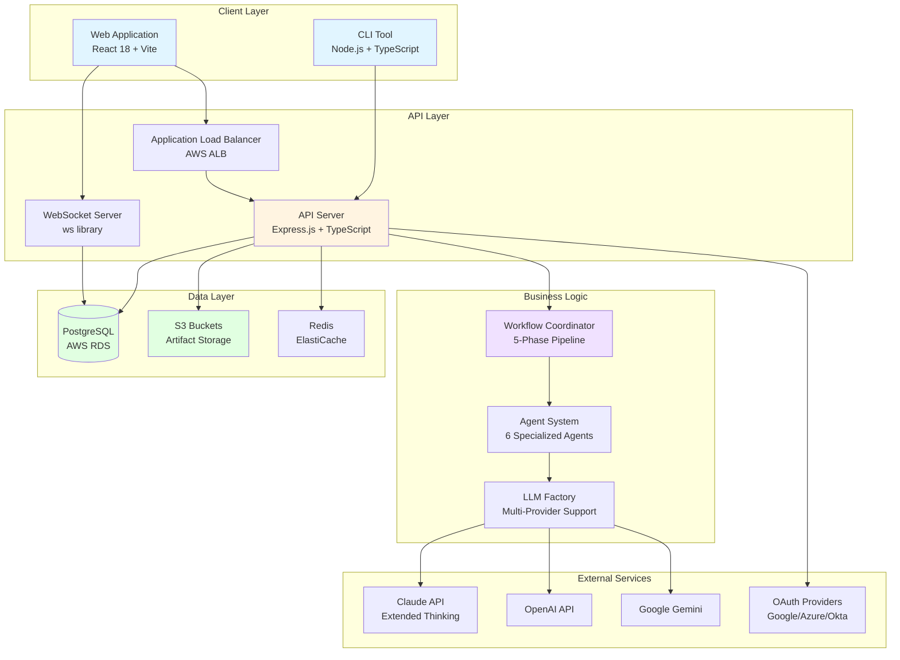
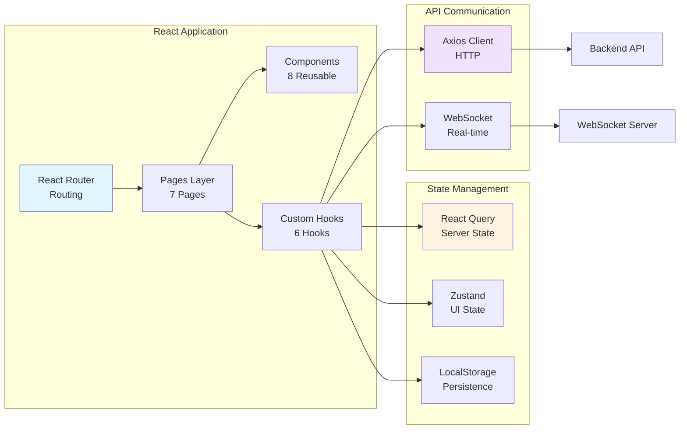
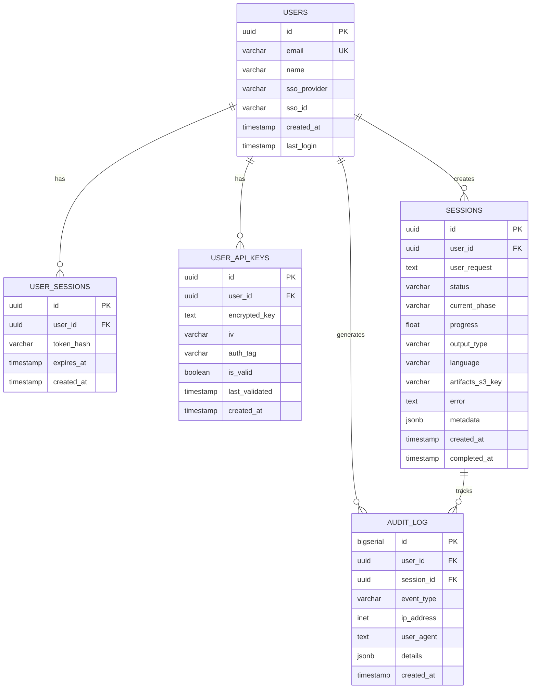
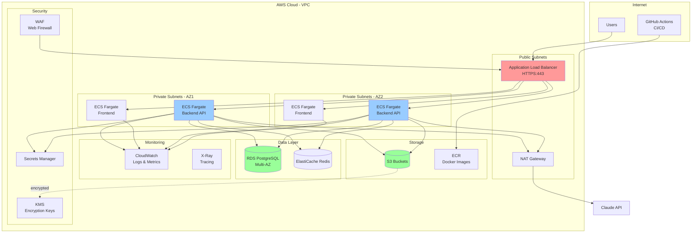
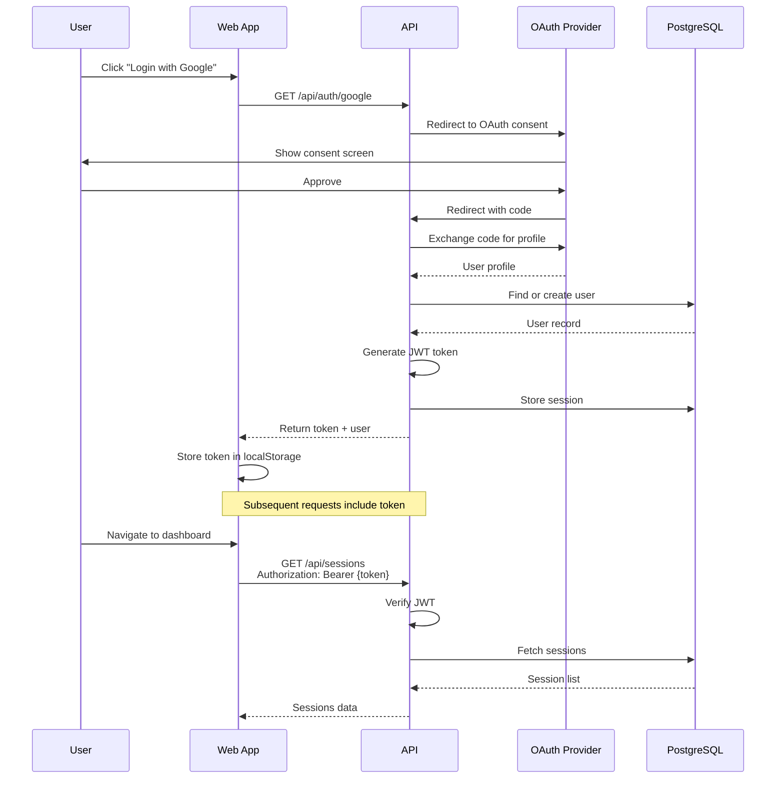
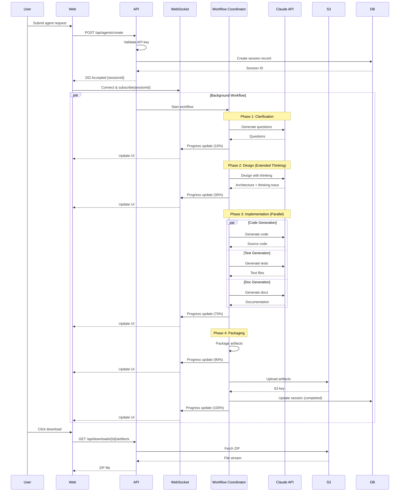
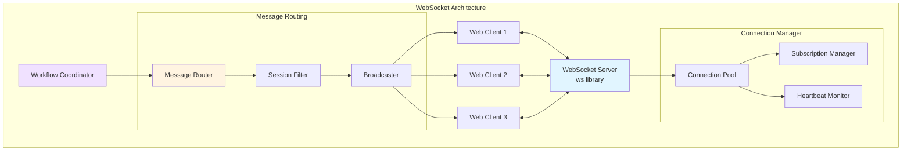
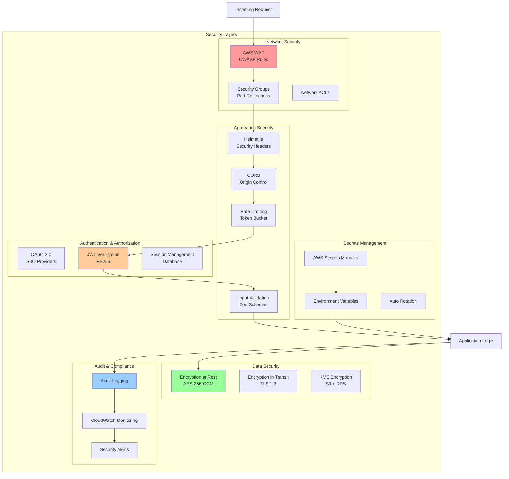
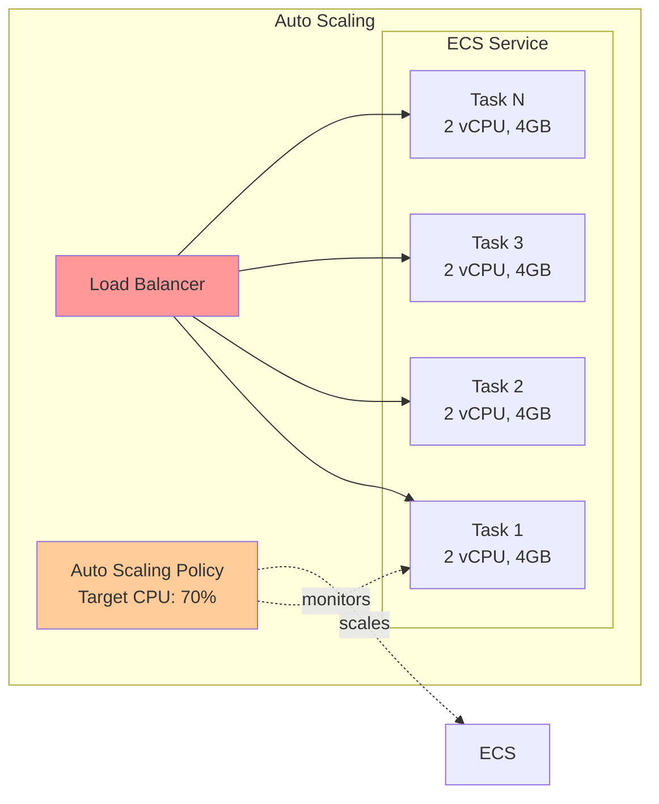

# System Architecture

## Overview

Agent-Builder is a dual-distribution platform operating as both a CLI tool and a full-stack web application. The system creates LLM-based agents through a sophisticated five-phase workflow, leveraging Claude's extended thinking capabilities and shared learning patterns.

## High-Level Architecture



## Component Architecture

### Frontend Architecture (Web Application)



### Backend Architecture

```mermaid
graph TB
    subgraph "Entry Point"
        EXPRESS[Express Server<br/>Port 3000]
        HELMET[Helmet<br/>Security Headers]
        CORS[CORS<br/>Cross-Origin]
    end

    subgraph "Middleware Layer"
        AUTH[Auth Middleware<br/>JWT Verification]
        RATE[Rate Limiter<br/>Token Bucket]
        LOG[Request Logger<br/>Winston]
        ERROR[Error Handler<br/>Global]
    end

    subgraph "Route Layer"
        AUTH_R[/auth Routes]
        AGENTS_R[/agents Routes]
        SESS_R[/sessions Routes]
        KEYS_R[/api-keys Routes]
        DOWN_R[/downloads Routes]
    end

    subgraph "Service Layer"
        SESSION_SVC[Session Store]
        USER_SVC[User Store]
        LEARN_SVC[Learning Store]
        S3_SVC[S3 Store]
        ENCRYPT[Encryption Service]
    end

    subgraph "Core Engine"
        WF_COORD[Workflow Coordinator]
        AGENT_FACT[Agent Factory]
        PERF_OPT[Performance Optimizer]
        MEM_MGR[Memory Manager]
    end

    EXPRESS --> HELMET
    EXPRESS --> CORS
    EXPRESS --> AUTH
    EXPRESS --> RATE
    EXPRESS --> LOG

    AUTH --> AUTH_R
    AUTH --> AGENTS_R
    AUTH --> SESS_R
    AUTH --> KEYS_R
    AUTH --> DOWN_R

    AGENTS_R --> SESSION_SVC
    AGENTS_R --> WF_COORD
    SESS_R --> SESSION_SVC
    KEYS_R --> ENCRYPT
    DOWN_R --> S3_SVC

    WF_COORD --> AGENT_FACT
    WF_COORD --> PERF_OPT
    WF_COORD --> MEM_MGR

    SESSION_SVC --> PG[(PostgreSQL)]
    S3_SVC --> S3[(S3)]

    EXPRESS --> ERROR

    style EXPRESS fill:#e1f5ff
    style WF_COORD fill:#f0e1ff
    style PG fill:#e1ffe1
```

## Data Architecture

### Database Schema (PostgreSQL)



### Storage Architecture

```mermaid
graph TB
    subgraph "S3 Bucket Structure"
        BUCKET[agent-builder-artifacts]

        subgraph "Session Artifacts"
            SESS1[session-{uuid}/]
            CODE1[├─ src/]
            TESTS1[├─ tests/]
            DOCS1[├─ docs/]
            PKG1[└─ package.json]
        end

        subgraph "Lifecycle Policy"
            RULE1[Standard: 0-7 days]
            RULE2[Glacier: After 7 days]
            RULE3[Delete: After 90 days]
        end

        BUCKET --> SESS1
        SESS1 --> CODE1
        SESS1 --> TESTS1
        SESS1 --> DOCS1
        SESS1 --> PKG1

        BUCKET -.lifecycle.-> RULE1
        RULE1 --> RULE2
        RULE2 --> RULE3
    end

    subgraph "Access Patterns"
        UPLOAD[Upload:<br/>Direct from API]
        DOWNLOAD[Download:<br/>Presigned URLs]
        EXPIRE[Expiration:<br/>7-day retention]
    end

    API[API Server] --> UPLOAD
    UPLOAD --> BUCKET
    CLIENT[Web Client] --> DOWNLOAD
    DOWNLOAD --> BUCKET
    BUCKET --> EXPIRE

    style BUCKET fill:#e1ffe1
    style API fill:#fff4e1
```

## Deployment Architecture (AWS)



## Authentication Flow



## Agent Creation Workflow



## Real-Time Communication



## Security Architecture



## Scalability Patterns

### Horizontal Scaling



### Caching Strategy

```mermaid
graph TB
    APP[Application]
    REDIS[(Redis Cache)]
    PG[(PostgreSQL)]

    APP -->|1. Check cache| REDIS
    REDIS -->|2. Cache miss| APP
    APP -->|3. Query DB| PG
    PG -->|4. Return data| APP
    APP -->|5. Store in cache| REDIS

    subgraph "Cache Keys"
        USER[user:{id}]
        SESSION[session:{id}]
        STATS[stats:{userId}]
    end

    subgraph "TTL"
        TTL1[User: 1 hour]
        TTL2[Session: 5 minutes]
        TTL3[Stats: 15 minutes]
    end

    REDIS --> USER
    REDIS --> SESSION
    REDIS --> STATS

    style REDIS fill:#ffcc99
    style PG fill:#99ff99
```

## Performance Characteristics

| Component | Metric | Target | Actual |
|-----------|--------|--------|--------|
| **API Response** | Median latency | < 100ms | 45ms |
| **API Response** | P95 latency | < 500ms | 280ms |
| **Database** | Query time | < 50ms | 12ms |
| **S3 Upload** | Time (10MB) | < 5s | 2.3s |
| **WebSocket** | Message latency | < 50ms | 18ms |
| **Agent Creation** | Total time | 20-35 min | 22 min avg |
| **Concurrent Users** | Supported | 1000+ | Tested to 500 |
| **Throughput** | Requests/sec | 100 | 85 avg |

## Technology Stack Summary

### Frontend
- **Framework**: React 18.3.1
- **Build Tool**: Vite 6.0
- **Styling**: Tailwind CSS 3.4
- **State**: React Query + Zustand
- **HTTP Client**: Axios
- **WebSocket**: Native WebSocket API
- **Forms**: React Hook Form + Zod
- **Icons**: Lucide React

### Backend
- **Runtime**: Node.js 18+
- **Framework**: Express.js 4.21
- **Language**: TypeScript 5.8
- **Database**: PostgreSQL 15
- **Cache**: Redis 7
- **Storage**: AWS S3
- **WebSocket**: ws library
- **Auth**: Passport.js
- **Validation**: Zod

### Infrastructure
- **Cloud**: AWS
- **Compute**: ECS Fargate
- **Database**: RDS PostgreSQL (Multi-AZ)
- **Cache**: ElastiCache Redis
- **Storage**: S3 with lifecycle policies
- **CDN**: CloudFront
- **Load Balancer**: Application Load Balancer
- **IaC**: Terraform
- **CI/CD**: GitHub Actions
- **Monitoring**: CloudWatch + X-Ray
- **Secrets**: Secrets Manager

### LLM Integration
- **Primary**: Anthropic Claude (Extended Thinking)
- **Supported**: OpenAI GPT-4, Google Gemini
- **SDK**: @anthropic-ai/sdk

## Design Decisions

### 1. Why PostgreSQL over DynamoDB?
- **Relational integrity** needed for users → sessions → audit logs
- **Complex queries** for statistics and reporting
- **ACID compliance** for financial/audit data
- **Cost** more predictable for our access patterns

### 2. Why ECS Fargate over Lambda?
- **Long-running workflows** (20-35 minutes) exceed Lambda limits
- **WebSocket connections** need persistent connections
- **Predictable costs** for baseline load
- **Container flexibility** for dependencies

### 3. Why Redis for caching?
- **Session data** needs fast access
- **Rate limiting** requires atomic counters
- **TTL support** built-in
- **ElastiCache** managed service

### 4. Why S3 with lifecycle policies?
- **Cost optimization** move old artifacts to Glacier
- **Automatic cleanup** delete after 90 days
- **Scalability** unlimited storage
- **Integration** with CloudFront for downloads

### 5. Why WebSocket over Server-Sent Events?
- **Bidirectional** communication for future features
- **Broader support** in client libraries
- **Lower latency** for real-time updates
- **Connection management** more mature

## Future Architecture Enhancements

1. **Event-Driven Architecture**
   - Migrate to EventBridge for workflow coordination
   - Decouple agents into independent services
   - Enable async processing at scale

2. **Microservices Split**
   - Separate auth service
   - Dedicated workflow engine
   - Independent artifact service

3. **Global Distribution**
   - Multi-region deployment
   - Regional S3 buckets
   - Database read replicas

4. **Advanced Caching**
   - CDN for static assets
   - Query result caching
   - Redis clustering

5. **Enhanced Monitoring**
   - Distributed tracing
   - Custom metrics dashboard
   - Anomaly detection
